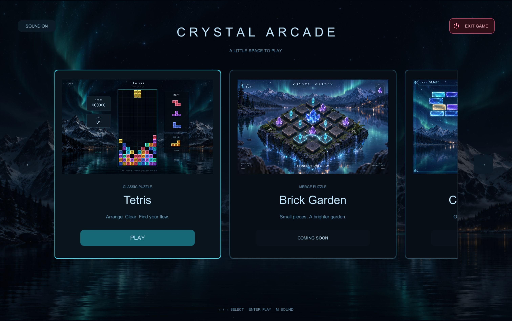
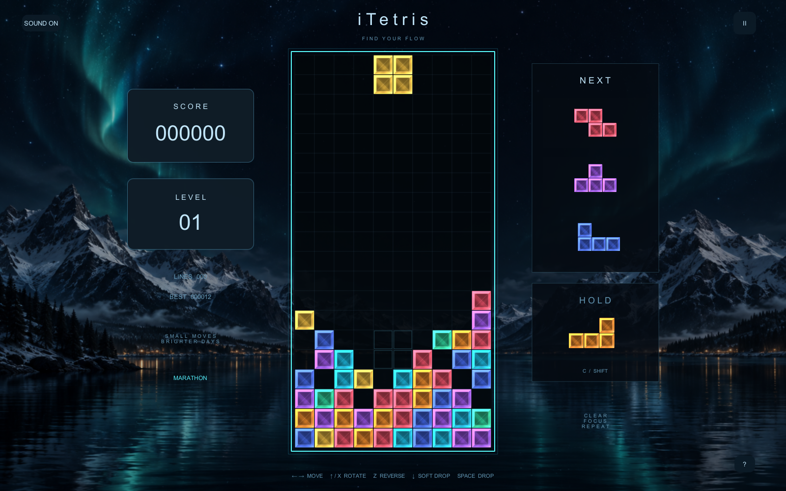
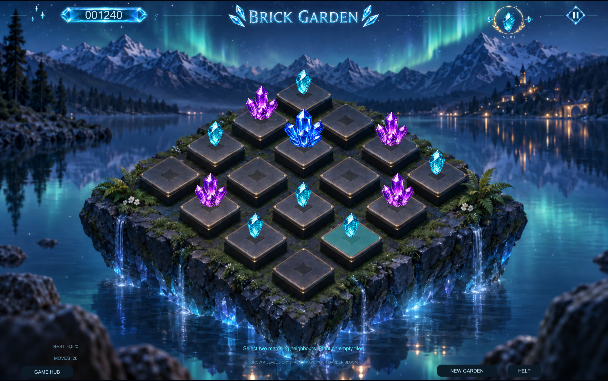
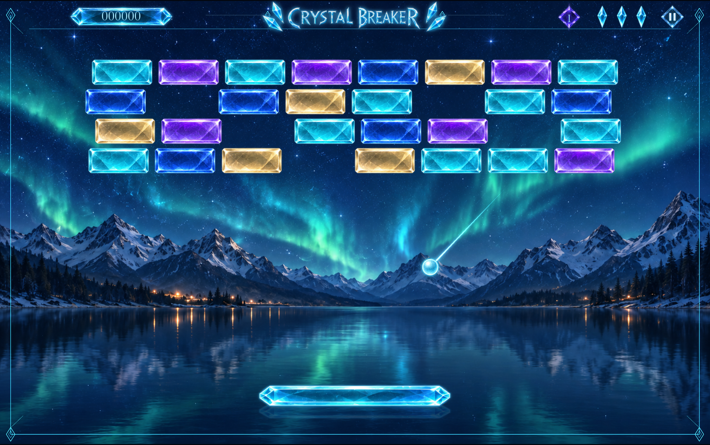
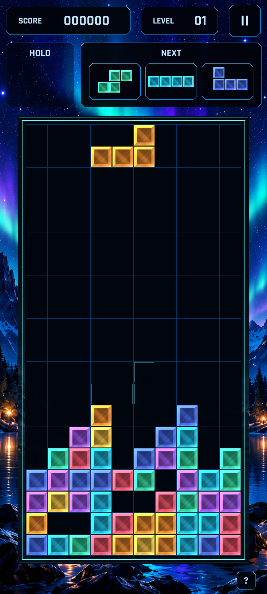

# iTetris — Crystal / Aurora

مجموعهٔ بازی‌های Crystal Arcade برای macOS، مرورگر و Android با Unity 6، رندر URP، بلوک‌های کریستالی و پس‌زمینهٔ شفق قطبی.

دامنهٔ نسخهٔ وب: [itetris.iboum.ir](https://itetris.iboum.ir). نسخهٔ جدید با هاب، تتریس و باغ آجری روی Cloudflare Pages منتشر شده و HTTPS فعال است.





## اجرا

پس از ساخت، برنامه در `Builds/iTetris.app` قرار می‌گیرد. نسخهٔ مک تمام‌صفحه با هاب انگلیسی **Crystal Arcade** شروع می‌شود. دکمهٔ **PLAY** روی کارت **Tetris** است و مستقیماً بازی را شروع می‌کند؛ هنگام بازگشت، همان دکمه به **RESUME** تبدیل می‌شود.

کارت‌های هاب به‌ترتیب: **Tetris**، **Brick Garden**، **Crystal Breaker**، **Light Path**، **Orbit Rings** و **Glass Tower**. در مک، **Tetris**، **Brick Garden** و **Crystal Breaker** قابل اجرا هستند؛ سه کارت دیگر **COMING SOON** هستند. در وب فعلاً دو بازی اول فعال‌اند. خروجی گوشی، اپ مستقل iTetris Mobile با تتریس است.

با کشیدن کارت‌ها، اسکرول، دکمه‌های چپ/راست یا کلیدهای جهت‌نما کتابخانه را مرور کنید. Enter بازی انتخاب‌شده را اجرا می‌کند. برای برگشت، در منوی توقف یا پایان بازی **GAME HUB** را بزنید؛ بازی در هاب متوقف می‌ماند. F11 حالت تمام‌صفحه را تغییر می‌دهد؛ دکمهٔ **EXIT GAME** با آیکون پاور برنامه را می‌بندد. خروجی برای Apple Silicon و Intel ساخته می‌شود و فایل اجرایی در Git نگهداری نمی‌شود.

در Unity Hub پوشهٔ همین پروژه را با Unity **6000.0.83f1** باز کنید. صحنهٔ `Assets/Scenes/iTetris.unity` را باز کنید و Play را بزنید. منوی `iTetris > Prepare Project` تنظیمات URP و صحنه را دوباره ایجاد می‌کند؛ این دستور صحنهٔ اصلی را بازنویسی می‌کند. برای تغییرات هنری، ابتدا از صحنه نسخهٔ جدا بگیرید.

## Brick Garden



باغ ۴×۴ با کریستال‌های هشت‌مرحله‌ای است. دو کریستال هم‌سطح و مجاور را انتخاب کنید تا روی سکوی دوم ادغام شوند؛ همسایهٔ قطری قابل ادغام نیست. روی سکوی خالی کلیک کنید تا کریستال NEXT کاشته شود. با ساخت کریستال سطح ۸ باغ شکوفا می‌شود و می‌توانید برای امتیاز بیشتر ادامه دهید. صفحهٔ پر بدون جفت قابل ادغام بازی را تمام می‌کند.

ماوس یا جهت‌نما و Enter/Space برای انتخاب؛ Esc برای توقف. وضعیت باغ و بهترین امتیاز خودکار روی همین مک ذخیره می‌شوند. محیط بر پایهٔ تصویر کانسپت با کریستال‌های شفاف مستقل ساخته شده است؛ سطح انتخاب و مرکز هر ۱۶ سکو روی تصویر کالیبره شده‌اند. جزئیات دارایی‌ها و پرامپت‌های تولید در [GardenArt.md](Documentation/GardenArt.md) آمده است.

## Crystal Breaker — فقط macOS



ظاهر این بازی مطابق مرجع با منظرهٔ مستقل، آجرهای شفاف در چهار ردیف، سکوی شیشه‌ای و نوار اطلاعات بالای صفحه بازطراحی شده است. [دارایی‌ها و پرامپت‌ها](Documentation/BreakerArt.md).

پنج مرحلهٔ کریستالی، سه جان، بلوک‌های مقاوم در مراحل بالاتر و بهترین امتیاز محلی. با ماوس یا ←/→ و A/D سکو را حرکت دهید؛ کلیک روی زمین بازی یا Space توپ را پرتاب می‌کند. قدرت زرد سکو را ۱۵ ثانیه بزرگ‌تر می‌کند و قدرت بنفش چند توپ ایجاد می‌کند. Esc/P توقف و ادامه؛ NEW GAME شروع دوباره و GAME HUB بازگشت به هاب. بازی هنگام از دست رفتن فوکوس متوقف می‌شود.

این بازی در نسخهٔ مک فعال است؛ در این تغییر خروجی وب و APK بازسازی یا منتشر نشده‌اند.

## کنترل‌ها

| کلید | کار |
| --- | --- |
| ← / → یا A / D | حرکت افقی |
| ↑ یا X یا W | چرخش ساعتگرد |
| Z | چرخش پادساعتگرد |
| ↓ یا S | سقوط نرم |
| Space | سقوط فوری |
| C یا Shift | ذخیره / تعویض قطعه |
| Esc یا P | توقف / ادامه |
| M | روشن / خاموش‌کردن صدا |
| F11 | تمام‌صفحه |

دکمهٔ `?` راهنمای داخل بازی را باز می‌کند. با خارج‌شدن فوکوس، بازی خودکار متوقف می‌شود. بهترین امتیاز و وضعیت صدا روی همین مک ذخیره می‌شوند.

## حالت‌ها و قواعد

**Marathon:** سرعت هر ۱۰ خط افزایش پیدا می‌کند. **Zen:** سقوط خودکار ندارد؛ قطعات را با Space در زمان دلخواه قرار دهید. حالت را در منوی آغاز یا توقف تغییر دهید.

بازی شامل کیسهٔ هفت‌قطعه‌ای، چرخش SRS با جابه‌جایی کنار دیوار و کف، پیش‌نمایش سه قطعه، محل فرود، ذخیرهٔ یک‌بار در هر قطعه و تأخیر قفل‌شدن ۰٫۵ ثانیه با حداکثر ۱۵ بازنشانی است. خطوط، ترکیب‌های پیاپی، چهارخط، T-spin و پاک‌کردن کامل صفحه امتیاز دارند. تشخیص T-spin از قاعدهٔ سه گوشه استفاده می‌کند؛ دسته‌بندی Mini و قواعد مسابقات رسمی پیاده نشده‌اند.

## ساخت و آزمایش

برای ساخت دوباره، `Tools/build-mac.command` را اجرا کنید یا از `iTetris > Build macOS` استفاده کنید. خروجی در Builds نوشته می‌شود.

آزمون‌های مستقل منطق با دستور زیر اجرا می‌شوند:

```sh
dotnet run --project Tools/RulesTests.csproj
```

این دستور به .NET 10 نیاز دارد. در خود Unity نیز `iTetris.Editor.ProjectBuilder.RunRulesTests` همان آزمون‌ها را اجرا می‌کند. نتیجه در `Documentation/RulesTests.txt` نوشته می‌شود.

## ساختار

- `Assets/Scripts/Core`: قواعد بازی مستقل از Unity و آزمون‌های آن.
- `Assets/Scripts/Runtime`: کنترل ورودی، رابط، بلوک‌ها، صدا و جلوه‌ها.
- `Assets/Settings`: تنظیمات URP و Renderer.
- `Assets/Resources/Art`: مدل OBJ و تصویر پس‌زمینه.
- `Assets/Resources/Audio/Aurora.wav`: موسیقی اصلی تولیدشده با سینتی‌سایزر محلی.
- `Documentation/CrystalBlock.blend`: مدل قابل‌ویرایش در Blender.
- `Documentation/VisualReference.png`: کانسپت اولیه.
- `Documentation/Gameplay.png`: تصویر ثبت‌شده از برنامهٔ واقعی پس از بررسی بصری.

مدل را می‌توان با `Tools/create_crystal.py` در Blender دوباره ساخت. موسیقی با `python3 Tools/create_audio.py` تولید می‌شود.

پس‌زمینه با ابزار داخلی imagegen ساخته شده است. شرح تولید: دریاچهٔ کوهستانی در شب، شفق ملایم فیروزه‌ای، کوه‌های برفی در دو طرف، آسمان مرکزی تیره برای خوانایی صفحه، بدون نوشته یا عناصر رابط. این فایل یک دارایی تصویری است؛ شفق با شیدر و ذرات کم‌تعداد در اجرا حرکت می‌کند. بلوک‌ها مدل سه‌بعدی با متریال براق و خطوط داخلی‌اند؛ شبیه‌سازی فیزیکی شکست نور شیشه نیستند.

## نسخهٔ اندروید

`Tools/build-android.command` یک APK قابل نصب در `Builds/Android/iTetrisMobile.apk` می‌سازد. منوی `iTetris > Build standalone mobile Tetris APK` هم در Unity موجود است. اپ مستقل **iTetris Mobile** با شناسهٔ `com.itetris.mobile` کنار Crystal Arcade نصب می‌شود. با صفحهٔ شروع و منوی کریستالی مستقل باز می‌شود و هاب یا بازی‌های دیگر در رابط آن وجود ندارند. امتیاز و تنظیمات آن مستقل از اپ قبلی ذخیره می‌شوند.

تتریس روی گوشی **عمودی و تمام‌صفحه** است. کنترل‌ها بر اساس حالت Swipe نسخهٔ EA تنظیم شده‌اند: کشیدن افقی برای حرکت، تپ نیمهٔ چپ برای چرخش پادساعتگرد و نیمهٔ راست برای چرخش ساعتگرد. کشیدن آرام رو به پایین، حتی اگر بلند باشد، سقوط نرم است؛ حرکت تند رو به پایین (Flick) با رهاکردن انگشت سقوط فوری انجام می‌دهد. حرکت تند رو به بالا یا لمس باکس **HOLD** ذخیره/تعویض قطعه است. تشخیص Flick بر سرعت بخش پایانی حرکت تکیه دارد تا پس از جابه‌جایی افقی هم کار کند و مکث قبل از رهاکردن باعث سقوط فوری نشود. قفل‌شدن قطعه یا لغو ژست از اثرگذاری روی قطعهٔ بعدی جلوگیری می‌کند.

مرجع کنترل‌ها: [بررسی دست‌اول نسخهٔ EA در TouchArcade، ۲۰۰۸](https://toucharcade.com/2008/07/14/eas-tetris-for-iphone-works/). این منبع حرکت آرام و Flick را جدا می‌کند و دو جهت چرخش را شرح می‌دهد. آستانه‌های داخلی EA در منبع منتشر نشده‌اند؛ حساسیت این اپ بر اساس اندازهٔ خانه و تست ژست‌ها تنظیم شده است. اپ از فاصلهٔ ثابت سه‌خانه‌ای برای سقوط فوری استفاده نمی‌کند. گزینهٔ **DROP** در منوی توقف نیز در دسترس است.

زمین با ابعاد گوشی تنظیم می‌شود، رابط محدودهٔ امن را رعایت می‌کند و پس‌زمینه تمام صفحه را می‌پوشاند. رفتن به پس‌زمینه بازی را متوقف می‌کند. نسخهٔ فعلی APK: **1.0.6**، کد نسخهٔ Android: **7**.

در نسخهٔ 1.0.5 انحراف جانبی انگشت در مسیر عمودی حذف می‌شود تا فلیک پایین مهره را ناخواسته به چپ یا راست نبرد. با تغییر جهت عمدی به افقی، حرکت افقی دوباره فعال است. ۱۷ تست بازگشت با رویدادهای واقعی Unity و ساعت کنترل‌شده، انحراف جانبی، نمونهٔ رهاکردن، تغییر جهت، سقوط نرم، هولد و لغو لمس را پوشش می‌دهند؛ نتیجه در `Documentation/GestureRegressionTests.txt` ثبت می‌شود.


نسخهٔ اول برای **Android 8 به بالا، ARM64 و OpenGL ES 3** است. APK با امضای پیش‌فرض توسعه برای نصب مستقیم ساخته می‌شود؛ فایل و کلید امضا در Git نگهداری نمی‌شوند. بازی‌ها آفلاین اجرا می‌شوند و امتیاز/باغ روی همان گوشی ذخیره می‌شوند.

منوهای خانه، توقف، پایان و راهنما روی صفحات مستقل نمایش داده می‌شوند. HUD شامل HOLD و دقیقاً سه NEXT کاملاً بالای زمین است؛ مدل و متریال مهره‌ها همان نسخهٔ قبلی است. لوگوی Unity از شروع اندروید حذف شده و آیکون اختصاصی کریستالی نصب می‌شود. تصاویر جدید با ساب‌ایجنت ساخته شده‌اند.



برای تکرار بررسی اجرایی روی گوشی یا شبیه‌ساز متصل، `Tools/test-android.command DEVICE_SERIAL` را اجرا کنید. این حالت تشخیصی قواعد، ژست‌ها، باکس هولد و محدودهٔ امن زمین را بررسی می‌کند و تصویر تتریس را دریافت می‌کند.

برای ساخت، ماژول Android Build Support همین Unity، SDK 36، NDK 27.2.12479018 و JDK 17 لازم‌اند. اسکریپت ابزارهای نصب‌شده کنار Unity را استفاده می‌کند؛ در این مک JDK 17 موجود در Homebrew انتخاب می‌شود. مسیر Java دلخواه را با `ITETRIS_JDK_PATH` مشخص کنید.

## نسخهٔ وب و Cloudflare Pages

نسخهٔ مرورگر با همان قواعد و گرافیک Unity، برای کامپیوتر دارای صفحه‌کلید ساخته می‌شود. کنترل‌های لمسی موبایل در این نسخه وجود ندارند. هاب انگلیسی با دو بازی Tetris و Brick Garden نمایش داده می‌شود. دکمهٔ Full Screen داخل هاب حالت تمام‌صفحه را فعال می‌کند؛ ارتفاع بازی برابر ارتفاع پنجره است و هدر ندارد. صدا بعد از تعامل با صفحه فعال می‌شود؛ بهترین امتیاز و وضعیت باغ در همان مرورگر ذخیره می‌شوند.

ماژول **Web Build Support** را برای Unity 6000.0.83f1 نصب کنید و سپس اجرا کنید:

```sh
Tools/build-web.command
```

خروجی در `Builds/Web` نوشته می‌شود. از منوی `iTetris > Build Web` نیز می‌توانید بسازید. صفحهٔ بارگذاری، خطا و تمام‌صفحه در `Assets/WebGLTemplates/Aurora/index.html` قابل‌ویرایش است.

برای پیش‌نمایش محلی، خروجی را با HTTP سرو کنید؛ فایل HTML را مستقیم با `file://` باز نکنید:

```sh
python3 -m http.server 8080 --directory Builds/Web
```

سپس `http://localhost:8080` را باز کنید. خروجی با Gzip و Decompression Fallback ساخته می‌شود، بنابراین به تنظیم Content-Encoding در میزبان نیاز ندارد. فایل `_headers` تنظیمات Cloudflare Pages را همراه خروجی قرار می‌دهد. ساخت وب اندازهٔ تک‌تک فایل‌ها را با محدودیت ۲۵ MiB در Pages بررسی می‌کند.

برای انتشار مجدد، Node.js 22 یا جدیدتر را انتخاب کنید و با Wrangler وارد حساب شوید. اسکریپت از Wrangler 4.147.0 استفاده می‌کند:

```sh
nvm use 22
npx --yes wrangler@4.147.0 login
export CLOUDFLARE_ACCOUNT_ID="YOUR_ACCOUNT_ID"
Tools/deploy-web.command
```

پروژهٔ Pages با نام `itetris` و شاخهٔ اصلی `main` استفاده می‌شود. دامنهٔ مورد نظر `itetris.iboum.ir` است. این انتشار از نوع Direct Upload است؛ پوش سورس به GitHub به‌تنهایی بازی را دوباره نمی‌سازد یا منتشر نمی‌کند.

در نسخهٔ 1.0.6، شارپ‌سازی محدود لبه‌ها روی تصاویر منو و اعداد زنده اعمال می‌شود؛ فیلتر دوخطی و آنتی‌الیاس حفظ می‌شوند. شدت اصلاح برای جلوگیری از هاله محدود شده است. رندر GPU قبل و بعد و تست‌های مربوط در `Documentation/MenuSharpnessTests.txt` و تصاویر `MenuSharpness*` موجودند.
